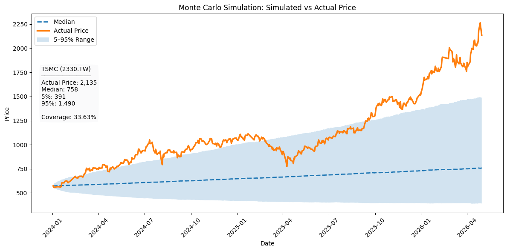
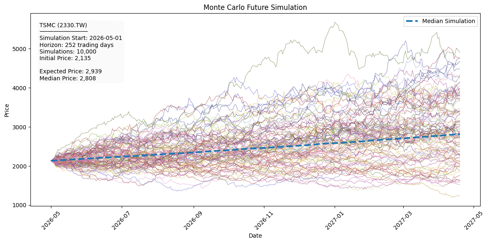
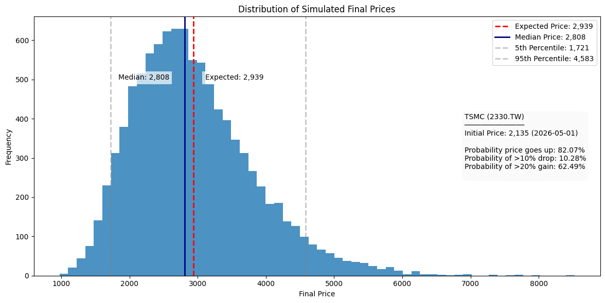

# Monte Carlo Simulation of TSMC Stock Prices

## Project Overview

Using Monte Carlo simulation and Geometric Brownian Motion (GBM) to model possible future price paths for Taiwan Semiconductor Manufacturing Company (TSMC, 2330.TW).

The project evaluates the model through historical validation and generates one-year future price scenarios to quantify uncertainty and potential outcomes.

---

## Methodology 

Data
- Asset: TSMC (2330.TW)
- Data Source: Yahoo Finance
- Period: 2020-01-01 to 2026-05-01
- Frequency: Daily adjusted closing prices

Model
Geometric Brownian Motion (GBM)

The simulation generates stock prices using the GBM process:

$$
S_t = S_{t-1} \times e^{(\mu - \frac{1}{2}\sigma^2)\Delta t + \sigma\sqrt{\Delta t}Z}
$$

where:

- $S_t$ = stock price at time $t$
- $\mu$ = annualized drift
- $\sigma$ = annualized volatility
- $\Delta t$ = time step
- $Z \sim N(0,1)$

---

## Model Validation

The GBM model underestimated TSMC's realized growth, achieving a coverage rate of 33.63%.

---

## Future Price Simulation

10,000 simulated price paths were generated over a one-year horizon.

---

## Distribution of Simulated Final Prices

- Expected Price: 2,939
- Median Price: 2,808
- 5th Percentile: 1,721
- 95th Percentile: 4,583

---

## Key Findings

- GBM provides a useful framework for modeling stock price uncertainty.
- The model produces probability distributions rather than point forecasts.
- Historical validation revealed substantial underestimation of TSMC's realized growth.
- Simulation results should be interpreted as scenario analysis rather than predictions.
- Model accuracy is limited by GBM assumptions such as constant drift, constant volatility, and log-normal returns.

